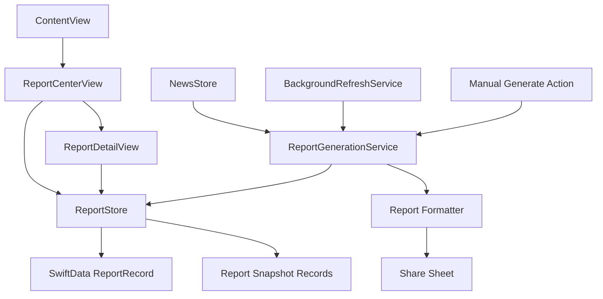

# 报告中心技术设计

Feature Name: report-center
Updated: 2026-08-21

## Description

报告中心是 TrendRadar iOS 应用中的独立信息归档模块。模块为每次满足条件的报告生成创建不可变快照，使用 SwiftData 持久化报告摘要、报告详情、新闻快照和 AI 分析结果，并通过 SwiftUI 提供报告列表、筛选、详情、收藏、分享和删除能力。

设计目标是将“新闻采集”和“报告归档”解耦。新闻刷新继续写入现有 `NewsRecord`，报告生成服务从当前新闻集合读取数据并创建 `ReportRecord` 及关联快照。历史报告使用自身快照，确保后续新闻变化不会改写历史内容。

## Architecture



### Design Decisions

- 报告中心使用独立的 `ReportStore`，避免把报告列表状态继续堆叠到 `NewsStore`。
- 报告生成使用独立的 `ReportGenerationService`，前台刷新、后台刷新和手动生成复用同一套逻辑。
- 报告列表使用摘要记录，报告详情使用关联快照记录，减少列表首次加载的数据量。
- 报告快照保存生成时的新闻字段、筛选配置摘要和 AI 结果，历史报告不依赖当前 `NewsRecord`。
- SwiftData 作为主存储，沿用现有 `LocalStore` 的容器初始化和迁移策略。
- 报告分享使用 `ReportFormatter` 生成纯文本，后续可以扩展 Markdown、HTML 和 PDF 格式。

## Components and Interfaces

### ReportStore

职责：管理报告列表状态、详情加载、收藏、删除和保留策略。

建议接口：

```swift
@MainActor
final class ReportStore: ObservableObject {
    @Published private(set) var reports: [ReportSummary]
    @Published private(set) var isLoading: Bool
    @Published var errorMessage: String?

    func load() async
    func loadMore() async
    func report(id: UUID) async -> ReportDetail?
    func toggleFavorite(id: UUID) async
    func delete(id: UUID) async
    func applyRetentionPolicy() async
}
```

### ReportGenerationService

职责：根据新闻集合、应用配置和生成来源创建报告快照。

建议接口：

```swift
struct ReportGenerationRequest: Sendable {
    let type: ReportType
    let trigger: ReportTrigger
    let generatedAt: Date
    let settings: AppSettings
}

struct ReportGenerationService: Sendable {
    func generate(
        request: ReportGenerationRequest,
        items: [NewsItem]
    ) async throws -> ReportDetail
}
```

`ReportTrigger` 包含 `manual`、`foregroundRefresh`、`backgroundRefresh` 和 `scheduled`。服务通过请求中的 `AppSettings` 固化报告类型、报告模式、显示区域、筛选方式和 AI 配置摘要。

### ReportCenterView

职责：展示报告中心入口页、报告统计、筛选控件、搜索框、报告卡片和手动生成操作。

页面结构：

1. 顶部标题和报告总数。
2. 最近报告摘要卡片。
3. 报告类型筛选和收藏筛选。
4. 报告搜索框。
5. 报告列表。
6. 空状态和“生成报告”按钮。

### ReportDetailView

职责：展示单份报告的完整快照内容。

页面结构：

1. 报告头部：标题、类型、生成时间、触发来源和收藏操作。
2. 统计卡片：新闻数、来源数、关键词数、未读数。
3. AI 分析卡片：分析状态、模型、语言和正文。
4. 按报告快照保存的区域和关键词分组展示新闻。
5. 新闻详情行：标题、来源、发布时间、摘要状态和原文链接。
6. 底部操作：分享、复制文本、删除。

### ReportFormatter

职责：把报告详情转换为可分享内容。

```swift
enum ReportFormat {
    case plainText
    case markdown
}

struct ReportFormatter {
    func render(_ report: ReportDetail, format: ReportFormat) -> String
}
```

第一阶段实现 `plainText` 和 `markdown`，保留 HTML 与 PDF 格式扩展点。系统分享面板根据用户选择提供文本或 Markdown 内容。

## Data Models

### SwiftData Models

```swift
@Model
final class ReportRecord {
    @Attribute(.unique) var id: String
    var title: String
    var reportType: String
    var trigger: String
    var generatedAt: Date
    var status: String
    var newsCount: Int
    var sourceCount: Int
    var unreadCount: Int
    var favoriteCount: Int
    var keywordCount: Int
    var aiEnabled: Bool
    var aiModel: String?
    var aiLanguage: String?
    var aiSummary: String?
    var settingsSnapshotJSON: Data?
    var isFavorite: Bool
    var failureMessage: String?
}
```

```swift
@Model
final class ReportItemRecord {
    @Attribute(.unique) var id: String
    var reportID: String
    var orderIndex: Int
    var sectionID: String
    var sectionTitle: String
    var keyword: String?
    var title: String
    var source: String
    var urlString: String?
    var publishedAt: Date?
    var summary: String?
    var isRead: Bool
    var isFavorite: Bool
}
```

### Application Models

```swift
enum ReportType: String, Codable, Sendable {
    case current
    case daily
    case incremental
    case manual
}

enum ReportStatus: String, Codable, Sendable {
    case generating
    case completed
    case failed
}

struct ReportSummary: Identifiable, Hashable, Sendable {
    let id: UUID
    let title: String
    let type: ReportType
    let generatedAt: Date
    let status: ReportStatus
    let newsCount: Int
    let sourceCount: Int
    let hasAIAnalysis: Bool
    let isFavorite: Bool
}

struct ReportDetail: Identifiable, Codable, Hashable, Sendable {
    let id: UUID
    let title: String
    let type: ReportType
    let trigger: ReportTrigger
    let generatedAt: Date
    let statistics: ReportStatistics
    let settingsSnapshot: ReportSettingsSnapshot
    let aiAnalysis: ReportAIAnalysis?
    let sections: [ReportSection]
    var isFavorite: Bool
}
```

### Storage and Migration

- 将 `ReportRecord` 和 `ReportItemRecord` 加入现有 SwiftData `ModelContainer` schema。
- 通过 `reportID` 关联报告和新闻快照，详情查询按照 `orderIndex` 排序。
- 报告保存采用“先写详情、再写摘要状态”的事务式流程。
- 应用升级时保留现有 `NewsRecord` 和 legacy `news.json` 迁移流程。
- 报告数据初始化为空集合，不影响已有新闻读取。
- 报告保留策略读取 `AppSettings.storage.localRetentionDays`；值为 `0` 时跳过过期清理，值大于 `0` 时清理超过保留天数的普通报告。
- 收藏报告在保留策略中具有优先保留权。
- 前台刷新、后台刷新和调度任务在生成报告前检查调度开关、报告模式和通知相关总开关，手动生成使用用户选择的报告类型。

## Correctness Properties

1. 每个已完成报告的 `ReportRecord.id` 在本地存储中唯一。
2. 每个 `ReportItemRecord.reportID` 都对应一个已存在的报告记录。
3. 已完成报告的新闻数量等于其关联快照记录数量。
4. 报告详情中的新闻字段来自生成时快照，后续 `NewsRecord` 更新不会改变报告详情。
5. 报告列表排序始终按照 `generatedAt` 倒序。
6. 报告生成失败时，报告状态为 `failed`，并保存错误说明。
7. 删除报告时，报告摘要和全部关联快照同时删除。
8. 收藏报告参与保留策略计算时保持保留状态。
9. 同一生成批次最多产生一份完成报告。
10. 报告分享文本包含报告头部、统计数据、AI 分析和全部可见新闻条目。
11. 报告保留策略不会删除收藏报告。
12. 同一生成批次只产生一份完成报告。

## Error Handling

| 场景 | 处理策略 |
|---|---|
| SwiftData 容器初始化失败 | 保持新闻功能可用，报告中心展示存储错误状态 |
| 报告详情不存在 | 返回报告中心并提示报告已不可用 |
| 报告保存失败 | 保留刷新结果，展示重试操作和错误原因 |
| AI 分析失败 | 保存无 AI 分析的已完成报告，并标记 AI 失败信息 |
| 分享内容过大 | 使用系统文本分享，并提供复制分段文本策略 |
| 报告删除失败 | 保留列表项，展示删除失败原因 |
| 生成请求重复 | 使用生成锁或批次 ID 合并请求 |

## Test Strategy

### Unit Tests

- 测试报告类型、触发来源和状态编码解码。
- 测试报告快照从 `NewsItem` 正确复制字段。
- 测试报告统计数量与关联新闻数量一致。
- 测试报告设置快照可以完成编码解码。
- 测试纯文本和 Markdown 格式化输出。
- 测试 `storage.local.retention_days` 为 `0` 时保留全部报告。
- 测试保留天数生效时清理过期普通报告并保留收藏报告。
- 测试同一生成批次的重复请求只生成一份报告。
- 测试报告列表搜索、类型筛选和收藏筛选。
- 测试保留策略保留收藏报告并清理过期普通报告。

### Integration Tests

- 测试前台刷新完成后生成并保存报告。
- 测试后台刷新完成后生成并保存报告。
- 测试应用重启后报告列表和详情可恢复。
- 测试删除报告时关联快照同时删除。
- 测试旧数据迁移不会影响新闻和报告容器初始化。

### UI Tests

- 测试从主界面进入报告中心。
- 测试空状态下生成首份报告。
- 测试点击报告卡片进入详情。
- 测试搜索、类型筛选、收藏和分享操作。
- 测试长报告列表的滚动和详情返回状态保持。

## Implementation Order

1. 新增报告领域模型和 SwiftData 模型。
2. 扩展本地存储容器和迁移策略。
3. 实现报告生成服务和报告统计计算。
4. 接入前台刷新、后台刷新和手动生成入口。
5. 实现 `ReportStore`。
6. 实现报告中心列表和详情页面。
7. 实现收藏、删除、保留策略和文本分享。
8. 增加单元测试、集成测试和 UI 测试。
9. 通过 GitHub Actions 验证 Swift 编译和无签名 IPA 打包。

## References

- `ios/TrendRadar/Services/LocalStore.swift`
- `ios/TrendRadar/Models/NewsRecord.swift`
- `ios/TrendRadar/Services/NewsStore.swift`
- `ios/TrendRadar/Services/BackgroundRefreshService.swift`
- `ios/TrendRadar/Views/ContentView.swift`
- `ios/TrendRadar/Models/NewsItem.swift`
