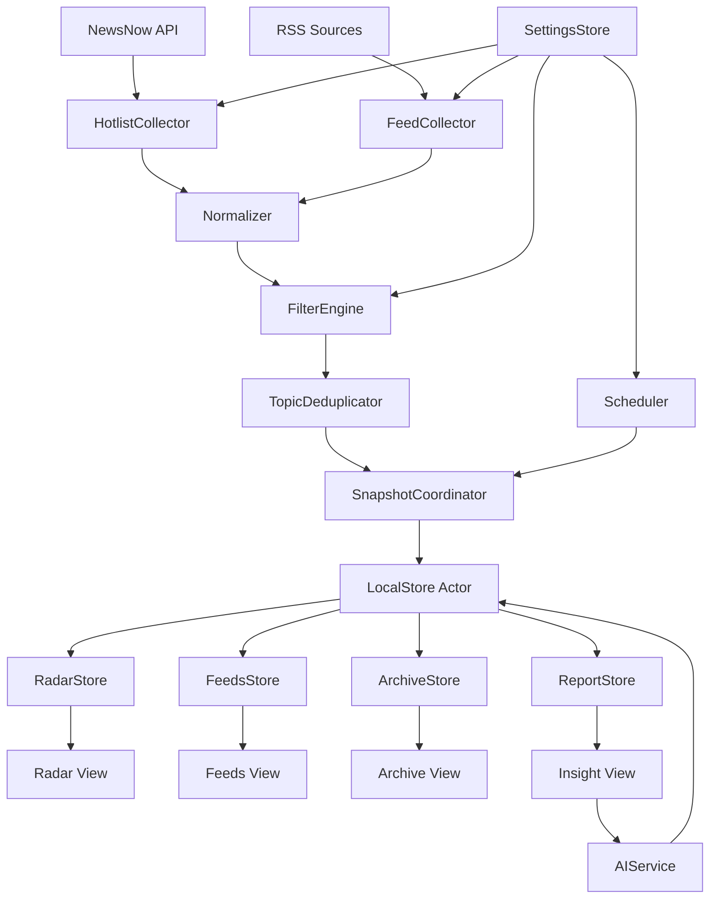

# TrendRadar 全量产品技术设计

Feature Name: trendradar-product-platform
Updated: 2026-08-22

## Description

本设计将现有 TrendRadar iOS 应用扩展为 Radar、Feeds、Insight、Archive、Settings 五模块产品。核心架构保持纯本地优先：采集层从 NewsNow 和 RSS 获取原始内容，规范化层生成统一情报条目，存储层保存当前数据和不可变快照，领域服务计算过滤、去重、趋势和报告，SwiftUI 页面消费各模块 Store。

## Current Baseline

- 已有 NewsNow 热榜获取、RSS 获取、关键词过滤、报告快照、AI 报告、SwiftData 本地存储和设置中心。
- 已有 `LocalStore.shared` 统一存储实例、`TrendRadar-v2.store` 隔离存储和 `news-v2.json` 降级文件。
- 当前 Radar 页面仍以 RSS 情报为主要列表，热榜以附属区域展示。
- 当前缺少统一跨平台主题模型、35+ 平台完整配置、历史热榜快照浏览、正文阅读器、收藏标签、自然语言查询和完整通知调度。

## Architecture



### Layer Responsibilities

1. **Collection**：负责 URL、请求、超时、解析和来源级错误，不修改 UI 状态。
2. **Normalization**：将 NewsNow 和 RSS 数据转换为统一 `IntelligenceItem`。
3. **Filtering**：应用包含、必须、排除关键词、独立展示源和用户屏蔽规则。
4. **Topic**：使用规范化标题、别名和可选语义标识合并跨平台主题。
5. **Snapshot**：在一次采集完成后写入当前表、历史快照表和失败记录。
6. **Domain Stores**：各模块管理页面状态，所有持久化通过共享 `LocalStore` actor。
7. **Presentation**：SwiftUI 负责页面组合、交互反馈和可访问性，不直接操作 SwiftData。

## Components and Interfaces

### Intelligence Models

```swift
enum IntelligenceSourceType: String, Codable, Sendable {
    case hotlist
    case rss
}

struct IntelligenceItem: Codable, Hashable, Identifiable, Sendable {
    let id: String
    let sourceType: IntelligenceSourceType
    let sourceID: String
    let sourceName: String
    let title: String
    let url: URL?
    let publishedAt: Date?
    let summary: String?
    let author: String?
    let topicKey: String
    var rank: Int?
    var previousRank: Int?
    var isRead: Bool
    var isFavorite: Bool
}
```

### Collectors

```swift
protocol IntelligenceCollector: Sendable {
    associatedtype Output: Sendable
    func collect(configuration: CollectorConfiguration) async -> CollectionResult<Output>
}
```

`HotlistCollector` 按最多 3 个平台一批执行；`FeedCollector` 按来源执行并返回解析阶段、HTTP 状态和缓存建议。

### FilterEngine

`FilterEngine` 接收统一情报条目和 `AppSettings`，输出普通展示条目、独立展示条目和过滤统计。过滤顺序固定为来源开关、排除规则、必须规则、包含规则、收藏/平台筛选。

### TopicDeduplicator

第一版使用确定性规则：Unicode 小写化、去除标点与空白、统一常见别名、截断无意义后缀，并使用平台条目集合生成主题。每个主题保留代表标题、平台集合、条目列表和匹配置信度。后续可增加本地 embedding 或 AI 聚类，且必须保留原始条目。

### SnapshotCoordinator

负责一次刷新批次的事务边界：接收成功条目、失败来源、配置摘要和采集时间，写入当前数据、`HotlistSnapshotRecord`、`FeedSnapshotRecord`、主题关联和刷新日志。成功平台替换对应旧内容，失败平台保留缓存。

### Stores

- `RadarStore`：当前主题、平台筛选、刷新状态、排名变化和平台失败详情。
- `FeedsStore`：来源、文章、正文缓存、未读和来源健康状态。
- `InsightStore`：报告列表、AI 查询会话、情绪面板和主题分析。
- `ArchiveStore`：收藏、标签、笔记、历史查询和导出。
- `SettingsStore`：应用配置和配置变更广播。

### Scheduler

统一处理前台手动刷新、本地通知和后台刷新请求。调度器持有最小任务入口，采集与报告逻辑复用前台服务。BGAppRefreshTask 仅在宿主支持并完成注册后启用，提交失败不影响前台。

## Data Models

### SwiftData Records

```text
IntelligenceRecord
HotlistSnapshotRecord
FeedRecord
FeedArticleRecord
ArticleBodyRecord
TopicRecord
TopicItemLinkRecord
FavoriteRecord
TagRecord
NoteRecord
ReportRecord
ReportItemRecord
AIConversationRecord
AIMessageRecord
RefreshRunRecord
```

关键关系：

- `TopicRecord` 关联多个 `IntelligenceRecord`，保留每个平台原始记录。
- `HotlistSnapshotRecord` 关联采集时间、平台和条目排名。
- `FeedArticleRecord` 关联 `FeedRecord`，`ArticleBodyRecord` 保存正文缓存。
- `FavoriteRecord` 使用资源类型和资源 ID，统一支持热榜、RSS、报告。
- `ReportRecord` 继续使用报告生成时的不可变快照。
- `AIMessageRecord` 保存引用条目 ID，保证回答可溯源。

### Migration Strategy

1. 保留现有 `TrendRadar-v2.store` 的报告和新闻模型。
2. 新模型使用可选字段和版本化 schema，先兼容空值。
3. 对无法迁移的旧数据使用独立新存储文件，避免启动阶段迁移崩溃。
4. 重置本机数据同时清理新旧本地记录和项目 Keychain 键。

## Correctness Properties

1. 同一 `IntelligenceItem.id` 在当前数据集中最多存在一条。
2. 同一主题的原始平台条目全部可追溯到其 `TopicRecord`。
3. 失败平台的缓存记录不会被空结果覆盖。
4. 报告快照内容不会随当前新闻记录变化。
5. 收藏资源在历史清理后仍保持可读取。
6. 每个 AI 引用都指向存在的本地条目或明确的失效引用状态。
7. 同一刷新批次最多产生一份报告和一份历史快照。
8. 所有 SwiftData 访问都经过同一个 `LocalStore` actor。

## Error Handling

- 网络错误：记录来源、URL、HTTP 状态、底层错误和发生时间，保留缓存。
- 解析错误：记录格式、字段和来源，标记来源健康状态。
- 去重错误：保留原始条目并使用独立主题，避免丢失情报。
- AI 错误：报告保留原始数据，AI 区域显示失败原因和重试入口。
- 存储错误：停止当前写入批次，保持上次可读数据，记录诊断信息。
- 通知错误：记录授权和调度状态，不阻塞采集与阅读。
- 重置错误：停止后续清理步骤，明确展示已完成范围和失败范围。

## Test Strategy

1. 单元测试：关键词三态匹配、主题规范化、跨平台去重、排名变化、时间范围、报告统计。
2. 解析测试：NewsNow JSON、RSS XML、Atom XML、正文抽取和异常字段。
3. 存储测试：快照写入、失败平台缓存、报告不可变、收藏保留、迁移和重置。
4. 集成测试：Radar 刷新、Feeds 刷新、报告生成、AI 引用、通知调度。
5. UI 测试：首次启动、平台筛选、文章阅读、报告详情、收藏、导出、重置反馈。
6. 性能测试：35 个热榜平台、5000 条历史条目、500 份报告和 200 条报告明细。
7. 真机测试：无网络、弱网络、LiveContainer 重装、后台任务不支持、Keychain 残留和低存储空间。

## Delivery Strategy

每个阶段遵循“数据模型 -> Store/领域服务 -> UI -> 测试 -> GitHub Actions IPA -> 真机回归”的顺序。阶段之间保持应用可启动、可刷新和可离线查看，禁止以未完成模块阻断现有纯本地能力。
