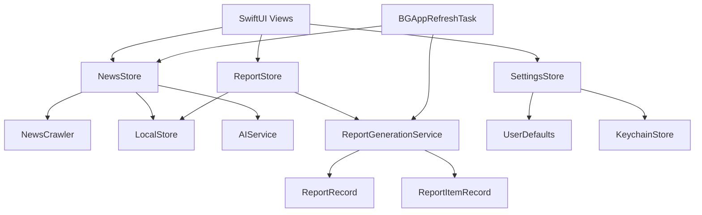

# TrendRadar iOS 本地情报终端方案

> 版本：2026-08-21  
> 方案定位：基于现有 TrendRadar 能力的纯 iPhone 本地优先产品设计  
> 当前分支：`260821-feat-ios-pure-mobile`

## 1. 方案结论

TrendRadar 的移动端产品定位为“本地优先的个人情报终端”。产品在 iPhone 上完成 RSS 采集、本地关键词筛选、新闻阅读、收藏、已读管理、AI 摘要、报告归档和本地通知，运行时依赖手机本地能力。

当前产品采用以下边界：

- iOS 17+ 原生 SwiftUI 应用。
- RSS 和 Atom 由手机直接通过 `URLSession` 抓取。
- 新闻和报告使用 SwiftData 保存。
- AI 通过用户自己配置的 OpenAI-compatible API 访问。
- AI API Key、通知渠道凭据和 S3 凭据使用 iOS Keychain 保存。
- 后台使用 `BGAppRefreshTask`，执行时间由 iOS 系统调度。
- GitHub Actions 构建无签名 IPA，用户通过侧载工具重新签名安装。
- 原 Python 项目和 `config/` 目录继续作为配置参考与功能来源。

远程 BFF、用户账户、多设备同步、服务端热榜抓取、APNs 服务端推送、MCP 客户端和订阅商业化属于后续产品线，当前方案不将这些能力作为移动端运行前提。

## 2. 现有项目能力盘点

### 2.1 原 TrendRadar 能力

| 能力层 | 原项目能力 | iOS 当前承接方式 |
|---|---|---|
| 数据采集 | 热榜平台、RSS、Atom | 当前 iOS 先承接 RSS/Atom；热榜平台配置已进入移动端模型，原始热榜接口接入作为后续阶段 |
| 筛选 | 关键词、频率词、AI 兴趣筛选 | 当前支持关键词、全局过滤词和 AI 参数配置；复杂频率词语法逐步迁移 |
| 分析 | AI 分析、AI 翻译、提示词文件 | 当前支持 AI 摘要和完整 AI 配置模型；分析报告与翻译服务分阶段接入 |
| 调度 | `timeline.yaml` 预设和时间段 | 当前支持预设选择和后台刷新间隔；精细时间段执行需要适配 iOS 系统调度限制 |
| 推送 | 飞书、钉钉、企业微信、Telegram、邮件、ntfy、Bark、Slack | 当前支持本地通知配置；服务端渠道字段已进入配置中心，移动端直接发送能力按安全边界逐步实现 |
| 存储 | SQLite、TXT、HTML、S3 | 当前主存储为 SwiftData；本地报告和新闻优先，S3 同步属于后续阶段 |
| MCP | MCP Server / 自然语言查询 | 保留为远程扩展方向，当前移动端不依赖 MCP |

### 2.2 当前 iOS 已实现能力

- SwiftUI 深色情报流首页。
- RSS/Atom XML 解析和并发抓取。
- Hacker News、BBC News 等默认 RSS 源。
- RSS 源启用、编辑和新增配置。
- 关键词筛选、全局过滤词和来源筛选。
- 新闻搜索、收藏、已读和原文打开。
- 新闻详情页和 AI 摘要。
- AI Base URL、模型、超时、Temperature、最大 Token、重试和备用模型配置。
- iOS Keychain 保存敏感凭据。
- SwiftData 新闻存储和旧 `news.json` 迁移。
- 后台刷新和本地通知。
- 完整配置中心，覆盖 `config/config.yaml` 的主要配置分组。
- 报告中心的规格文档、报告领域模型和 SwiftData 报告模型正在实现。

## 3. 产品定位与用户价值

### 3.1 核心定位

TrendRadar iOS 负责把用户关注的信息源压缩成可回顾、可筛选、可分析的个人情报流。

产品价值按照优先级排序：

1. 减少多平台切换和重复阅读。
2. 让用户可以快速定位关注主题。
3. 让新闻内容和 AI 结论在手机本地可回顾。
4. 通过报告快照保留每次生成时的信息上下文。
5. 用后台刷新和本地通知提供低打扰提醒。

### 3.2 目标用户

- 科技从业者：关注 AI、芯片、互联网和产品动态。
- 内容创作者：寻找选题和趋势素材。
- 研究者和分析师：需要长期保存信息快照。
- 个人信息管理用户：希望减少信息源切换。

## 4. 产品信息架构

当前采用轻量导航，优先保持现有应用可维护性：

```text
TrendRadar
├── 情报流
│   ├── 新闻列表
│   ├── 来源筛选
│   ├── 搜索
│   ├── 收藏
│   └── 新闻详情
├── 报告中心
│   ├── 报告列表
│   ├── 报告筛选
│   ├── 报告详情
│   ├── 报告收藏
│   └── 文本/Markdown 分享
└── 配置中心
    ├── 基础与调度
    ├── 平台与 RSS
    ├── 关键词与筛选
    ├── AI 模型、分析与翻译
    ├── 推送展示
    ├── 通知渠道
    ├── 存储
    └── 高级参数
```

### 4.1 页面职责

| 页面 | 主要职责 | 数据来源 |
|---|---|---|
| 情报流 | 浏览当前新闻、搜索、来源筛选和刷新 | `NewsStore`、`NewsRecord` |
| 新闻详情 | 阅读单条新闻、生成 AI 摘要、打开原文 | `NewsItem`、`AIService` |
| 报告中心 | 浏览历史报告、筛选、搜索、生成报告 | `ReportStore`、`ReportRecord` |
| 报告详情 | 查看不可变报告快照、AI 分析和新闻分组 | `ReportDetail`、`ReportItemRecord` |
| 配置中心 | 编辑移动端配置和敏感凭据 | `SettingsStore`、Keychain |

## 5. 技术架构

### 5.1 当前架构



### 5.2 分层职责

#### UI 层

- 使用 SwiftUI 和现有 `AppTheme`。
- 页面只负责展示、用户交互和导航。
- 业务状态由 `ObservableObject` Store 持有。
- 报告详情读取快照模型，不直接依赖当前新闻列表。

#### Store 层

- `NewsStore`：刷新新闻、保存新闻、收藏、已读和 AI 摘要。
- `ReportStore`：加载报告摘要、加载报告详情、收藏、删除和保留策略。
- `SettingsStore`：保存 Codable 配置到 UserDefaults。

#### Service 层

- `NewsCrawler`：请求 RSS/Atom 并解析 XML。
- `AIService`：调用用户配置的 OpenAI-compatible Chat Completions API。
- `ReportGenerationService`：从当前新闻集合生成报告快照。
- `ReportFormatter`：生成纯文本和 Markdown 分享内容。
- `BackgroundRefreshService`：注册和执行后台刷新任务。
- `KeychainStore`：保存敏感配置。

#### Storage 层

- SwiftData 保存 `NewsRecord`、`ReportRecord`、`ReportItemRecord`。
- UserDefaults 保存非敏感应用配置。
- Keychain 保存 API Key、Webhook、密码和访问密钥。
- 旧 `news.json` 只用于历史数据迁移。

### 5.3 技术选型校正

| 领域 | 当前方案 | 选择理由 |
|---|---|---|
| UI | SwiftUI | 已有代码基础，适合 iOS 17 和快速迭代 |
| 状态 | `ObservableObject` + Combine | 当前代码已经采用，降低迁移风险 |
| 存储 | SwiftData | 当前新闻存储已使用，报告模型可共享容器 |
| 网络 | Foundation `URLSession` | RSS 和 AI 请求规模适中，减少第三方依赖 |
| XML | Foundation `XMLParser` | 已有 RSS/Atom 解析实现 |
| 密钥 | Security Keychain | 满足本地敏感信息隔离要求 |
| 后台 | `BGAppRefreshTask` | 已有注册和调度实现，符合系统机制 |
| 图表 | 后续按需引入 Swift Charts | 当前没有趋势时间线数据模型，不提前引入复杂依赖 |

当前不引入 Alamofire、Moya、GRDB、Kingfisher、Core ML、MLX Swift。项目当前没有这些依赖对应的运行需求，引入会增加包管理、构建和维护成本。

## 6. 报告中心设计

报告中心是当前产品的核心扩展，具体需求和设计以以下规格为准：

- `当前工作区/.monkeycode/specs/2026-08-21-report-center/requirements.md`
- `当前工作区/.monkeycode/specs/2026-08-21-report-center/design.md`
- `当前工作区/.monkeycode/specs/2026-08-21-report-center/tasklist.md`

### 6.1 报告快照原则

报告生成时复制以下内容：

- 标题、来源、URL、发布时间。
- 生成时的新闻摘要。
- 已读和收藏状态。
- 报告类型、生成触发来源和生成时间。
- 统计数据。
- 关键词、筛选方式、报告模式和区域顺序。
- AI 模型、语言、分析内容和失败信息。

后续刷新更新 `NewsRecord` 时，历史报告仍读取 `ReportItemRecord` 中的快照字段。

### 6.2 报告生成策略

- 用户手动点击“生成报告”时生成 `manual` 报告。
- 前台刷新完成后根据调度和报告模式决定是否生成。
- 后台刷新完成后根据相同规则决定是否生成。
- 同一生成批次通过批次 ID 去重。
- AI 分析失败时保存完整新闻报告，并记录 AI 失败信息。
- 报告保留读取 `storage.local.retention_days`。
- 收藏报告不参与普通过期清理。

## 7. 配置中心映射策略

### 7.1 配置层级

```text
AppSettings
├── 基础：timezone、showVersionUpdate
├── 调度：scheduleEnabled、schedulePreset、refreshInterval
├── 平台：platformsEnabled、platformAPIURL、platformSources
├── RSS：rssEnabled、freshness、customFeeds
├── 报告：report、display
├── 筛选：keywords、globalFilterWords、AI filter
├── AI：model、analysis、translation
├── 通知：localAlerts、channels
├── 存储：storage
└── 高级：advanced
```

### 7.2 配置持久化原则

- 普通字段使用 `AppSettings` Codable JSON 存入 UserDefaults。
- 敏感字段只写入 Keychain，不写入 AppSettings JSON。
- 旧版 JSON 解码使用 `decodeIfPresent` 和默认值，保持升级兼容。
- RSS 源在保存前校验 ID、名称和 URL。
- 配置改变后通过保存操作同步到 `NewsStore`。
- 配置字段命名可以与 YAML 语义对应，Swift 属性保持 Swift 命名规范。

## 8. 数据模型

### 8.1 新闻模型

当前 `NewsItem` 负责应用层展示：

```swift
struct NewsItem: Codable, Identifiable, Hashable, Sendable {
    let id: String
    let title: String
    let source: String
    let url: URL?
    let publishedAt: Date?
    var summary: String?
    var isRead: Bool
    var isFavorite: Bool
}
```

当前版本没有原项目中的完整热榜排名轨迹模型，因此排名变化图、跨平台话题聚合和热度预测需要新增数据源与数据模型后实现。

### 8.2 报告模型

```swift
@Model
final class ReportRecord {
    @Attribute(.unique) var id: String
    var title: String
    var reportType: String
    var trigger: String
    var generatedAt: Date
    var status: String
    var newsCount: Int
    var sourceCount: Int
    var unreadCount: Int
    var favoriteCount: Int
    var keywordCount: Int
    var aiEnabled: Bool
    var aiModel: String?
    var aiLanguage: String?
    var aiSummary: String?
    var settingsSnapshotJSON: Data?
    var isFavorite: Bool
    var failureMessage: String?
}
```

`ReportItemRecord` 保存报告内的新闻快照，并通过 `reportID` 关联报告。

### 8.3 后续趋势模型

只有数据源能提供同一主题在多个时间点的排名、热度或出现次数时，才引入以下模型：

- `TopicRecord`：归并后的主题。
- `TopicMentionRecord`：主题在来源和时间点上的出现记录。
- `RankSnapshot`：来源、时间和排名。
- `TopicTrend`：趋势计算结果。

当前 RSS 新闻只有单条文章发布时间，无法推导真实排名轨迹，产品界面暂不展示虚构的趋势图。

## 9. 功能路线图

### Phase 0：当前基础能力

- SwiftUI 情报流。
- RSS/Atom 抓取和解析。
- 本地关键词筛选。
- 新闻搜索、收藏、已读和详情。
- AI 摘要。
- Keychain AI 配置。
- SwiftData 新闻存储。
- 后台刷新和本地通知。
- 配置中心。

### Phase 1：报告中心

- 完成 `ReportRecord` 和 `ReportItemRecord` 接入 SwiftData 容器。
- 完成报告 CRUD 和快照级联删除。
- 完成 `ReportGenerationService`。
- 接入前台刷新、后台刷新和手动生成。
- 完成报告列表、筛选和详情。
- 完成报告收藏、删除、文本分享和 Markdown 分享。
- 完成按本地保留天数清理普通报告。

### Phase 2：本地分析增强

- 关键词组编辑器，支持包含词、必须词、过滤词、别名和数量限制。
- AI 兴趣描述编辑和本地配置导入。
- AI 分析报告结构化展示。
- AI 翻译服务接入。
- 报告中增加来源统计、主题分组和本地时间线。
- 使用 Swift Charts 展示已具备数据基础的统计图。

### Phase 3：热榜和趋势能力

- 评估 NewsNow API 的移动端直接访问方案。
- 增加热榜平台请求、域名校验和缓存。
- 建立主题归并和排名快照模型。
- 增加跨平台主题详情。
- 增加真实排名趋势图和异动识别。

### Phase 4：可选远程扩展

- BFF API。
- 用户账户和多设备同步。
- APNs 服务端推送。
- 远程报告同步和 S3 存储。
- MCP 客户端或远程查询。
- Widget、App Intents 和 Apple Watch。

远程扩展必须以实际用户需求、隐私策略、运维成本和账号体系设计为前置条件，不能作为纯本地版本的隐式依赖。

## 10. 交互与视觉设计

### 10.1 视觉方向

- 深色墨蓝背景，延续现有 `AppTheme`。
- 青绿色作为信息流和主要操作色。
- 黄色表示提醒和重点。
- 粉色表示收藏或个人状态。
- 卡片采用高对比标题和低干扰元信息。
- 重要状态使用文字和颜色双重表达，保证可读性。

### 10.2 情报流

- 顶部显示新闻统计和刷新状态。
- 横向来源筛选保持当前交互。
- 新闻卡片展示来源、标题、时间、摘要状态和收藏状态。
- 搜索和刷新保持系统原生手势。
- 当前不加入短视频式连续播放、复杂滑动操作和浮动 AI 球，避免削弱阅读效率。

### 10.3 报告中心

- 报告卡片显示类型、时间、新闻数、来源数和 AI 状态。
- 报告详情采用“头部摘要、统计卡、AI 分析、分组新闻”的结构。
- 报告快照与当前新闻使用不同视觉标识，提醒用户当前页面展示的是历史内容。
- 分享优先使用系统 Share Sheet，减少自定义分享基础设施。

### 10.4 配置中心

- 按业务分组组织表单，避免单页堆叠无关字段。
- 敏感字段使用 `SecureField`。
- 高级设置单独放置，并提供默认值说明。
- RSS 和平台配置支持逐项编辑。
- 保存前校验 URL、ID、范围和权重。

## 11. 安全与隐私

- AI API Key 不写入代码、仓库、UserDefaults 或报告快照。
- Webhook、Telegram Token、邮箱密码和 S3 密钥只写入 Keychain。
- 报告快照可能包含用户关注主题和 AI 内容，默认仅存储在本机。
- 原文请求通过 HTTPS 优先；用户自定义 HTTP RSS 源时展示配置风险提示。
- 网络请求设置超时并处理非 2xx 响应。
- AI 请求只发送新闻标题和必要摘要，发送范围受配置控制。
- 不实现绕过认证、批量抓取或未授权数据访问能力。

## 12. 错误处理与可恢复性

| 场景 | 用户体验 | 恢复方式 |
|---|---|---|
| RSS 请求失败 | 保留上次数据并显示刷新失败 | 下拉重试、逐源重试 |
| XML 解析失败 | 标记异常源，不影响其他源 | 修改源地址后重试 |
| AI 配置缺失 | 允许继续阅读，摘要按钮显示配置提示 | 配置 API Base URL 和 Key |
| AI 请求失败 | 显示明确错误，不丢失新闻 | 重试摘要或调整 AI 设置 |
| SwiftData 保存失败 | 保留内存结果并提示本地存储错误 | 应用重启后重试保存 |
| 报告生成失败 | 保存失败状态和原因 | 重新生成报告 |
| 后台任务未执行 | 不向用户承诺精确时间 | 打开应用时主动刷新 |
| IPA 无法直接安装 | 在交付说明中提示重新签名侧载 | 使用 SideStore、AltStore 或 Sideloadly |

## 13. 测试策略

### 单元测试

- RSS/Atom XML 解析。
- HTML Entity 解码。
- `AppSettings` 默认值、旧 JSON 兼容和丰富配置往返编码。
- 报告快照字段复制和恢复。
- 报告统计、分组和报告类型映射。
- AI 请求体参数和 `max_tokens = 0` 的省略行为。
- 报告保留策略和收藏报告保留。

### 集成测试

- 新闻刷新后保存 SwiftData。
- 报告生成后保存报告摘要与新闻快照。
- 修改当前新闻后历史报告内容保持不变。
- 删除报告时关联快照同步删除。
- 应用重启后恢复新闻、配置和报告。
- 前台和后台使用同一套 RSS 配置。

### CI 验证

GitHub Actions 使用 macOS runner 执行：

```text
xcodegen generate
xcodebuild build CODE_SIGNING_ALLOWED=NO CODE_SIGNING_REQUIRED=NO
zip -qry TrendRadar-unsigned.ipa Payload
```

最终 IPA 必须包含：

```text
Payload/TrendRadar.app/TrendRadar
Payload/TrendRadar.app/Info.plist
```

## 14. 关键风险与控制

| 风险 | 控制措施 |
|---|---|
| iOS 后台时间不稳定 | 使用系统允许的最早执行时间，并在前台启动时补偿刷新 |
| RSS 源格式差异 | XML Parser 容错、逐源错误隔离和测试样例 |
| AI 成本和延迟 | 本地去重、摘要按需生成、超时、Token 上限和缓存 |
| 历史报告数据膨胀 | 本地保留天数、收藏保护、分页详情加载 |
| 热榜 API 接入不稳定 | 独立适配器、缓存、域名校验和降级展示 |
| 方案范围膨胀 | 以纯本地 Phase 1 为交付边界，远程能力单独立项 |
| 无签名 IPA 安装失败 | 固定 Payload 目录和 Bundle 元数据，交付前验证 IPA 结构 |

## 15. 交付判断标准

Phase 1 报告中心满足以下条件后进入可用状态：

1. 用户可以从主界面进入报告中心。
2. 用户可以手动生成一份报告并在列表中看到报告卡片。
3. 前台或后台刷新可以按照配置自动生成报告。
4. 报告详情展示生成时保存的新闻快照。
5. 当前新闻更新不会改变历史报告。
6. 用户可以收藏、删除和分享报告。
7. 报告按本地保留策略清理普通历史数据。
8. 应用重启后报告仍可离线查看。
9. GitHub Actions 可以成功构建无签名 IPA。

这份方案以当前代码为真实基线，把远期产品愿景拆成可验证阶段，优先交付稳定的本地情报流、配置中心和报告中心。
